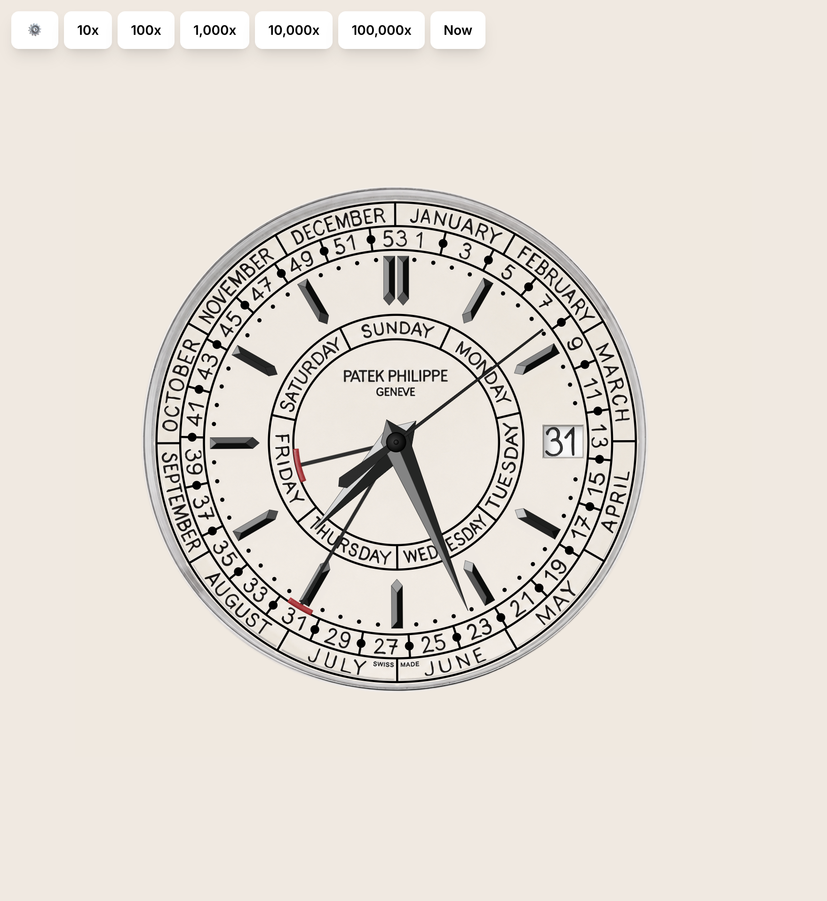
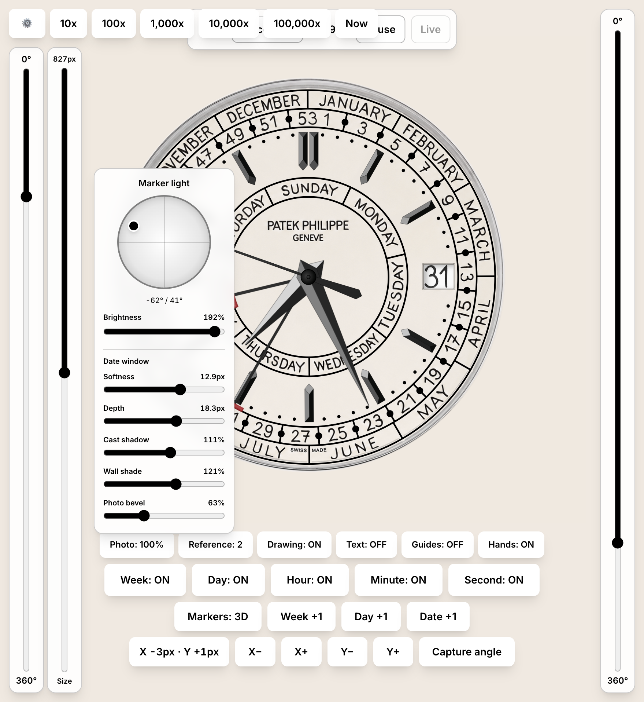

# 5212 — Patek Philippe Weekly Calendar Dial

Pixel-calibrated digital reconstruction of the **Patek Philippe Calatrava Weekly Calendar Ref. 5212A-001**.

The app overlays a programmatic React/SVG dial on a 2911×2683 orthographic reference photograph. The photo, drawing, guides, and individual hands can be toggled independently for alignment work. The long-term target is a clean dial bitmap plus rotatable hand assets for a Garmin Fenix 7/8 watch face.

<p align="center">
  
  
</p>

## Current state

Implemented and calibrated:

- Concentric day, week, month, minute, and dial-edge geometry.
- Month, week, and weekday sector divisions.
- Filled week separator dots and minute markers.
- Four-facet applied hour batons, including the double marker at 12 and the date-window omission at 3.
- Week numerals, month names, and weekday names rendered in **Indie Flower**, with measured per-glyph centers and manual optical corrections.
- Cream reference background and matching page background.
- Five independently rendered hands in the correct stack:
  1. Day-of-week hand
  2. Week-of-year/month hand
  3. Hour hand
  4. Minute hand
  5. Seconds hand
- Local-time hour and minute positioning.
- Mechanical seconds motion at eight steps per second, matching the 4 Hz / 28,800 semi-oscillations-per-hour caliber 26-330 S C J SE.
- Perpetual local-calendar synchronization for the exact ISO week, weekday, and date, including variable month lengths and leap years.
- An aligned 1–31 date wheel isolated from the supplied movement photograph and composited beneath a transparent Reference 2 aperture with its original bevel shadow. Invalid end-of-month dates are skipped automatically.

Not implemented yet:

- Garmin 260×260 export and asset-generation pipeline.
- Production watch-face integration and MIP/AOD optimization.

## Run locally

```bash
npm run dev
```

The Vite preview is configured for `0.0.0.0:8080`.

Useful verification commands:

```bash
npm test
npm run typecheck
npm run lint
```

The Vitest lighting suite guards aperture-shadow continuity at the zenith, zero-brightness behavior, hour-hand facet planarity, and back-face specular masking.

## macOS screensaver

The repository can build a native `.saver` bundle containing an offline, button-free version of the watch. It uses the Mac's local time and includes all dial imagery and the Indie Flower font inside the bundle.

Requirements: macOS 13 or newer, Node.js, and the Xcode Command Line Tools.

```bash
npm ci
npm run build:screensaver
open "$(pwd)/build/5212 Weekly Calendar.saver"
```

The final command opens macOS's screen-saver installer. Approve replacing the existing copy when upgrading, then select **5212 Weekly Calendar** in **System Settings → Screen Saver**. The generated bundle is universal and runs natively on both Apple Silicon and Intel Macs.

See [Building and installing the macOS screensaver](docs/SCREENSAVER.md) for prerequisites, architecture, rebuilding, verification, and troubleshooting.

## Controls

All controls live in a single draggable **Controls** window, shown or hidden by the persistent `⚙️` button. The window drags by its header — including past the screen edges — and groups its controls into three tabs:

1. **Time** — timeline speed, pause/continue, hand inspection, and calendar advances.
2. **Layers** — display layers, individual hand visibility, and the marker rendering mode.
3. **Light** — the hemisphere light position, brightness, and date-window shading.

The **Time** tab accelerates the simulated watch timeline from the local time captured when the page opens with `10x`–`100,000x` multipliers; pressing the active multiplier again returns to real-time speed. `Now` resets the simulated instant and all manual hand/date overrides to the current local time while preserving the selected speed. The mechanical eight-step seconds animation remains active through 10x, then switches to continuous simulated rotation above 10x so high-speed playback has no artificial beat pauses. The hand selector shows any hand's current angle, `Pause`/`Continue` freeze and resume the simulated timeline, and `Live` returns a manually positioned hand to its live clock/calendar angle. `Week +1`, `Day +1`, and `Date +1` advance their displays by one step; manual date and weekday positioning returns to live synchronization at the next simulated local date boundary, and manual week positioning returns at the next ISO-week boundary. Speed changes and pause/continue preserve the current simulated instant instead of snapping back to the computer clock.

The **Layers** tab cycles `Photo` through 100%, 50%, and OFF, and `Reference` between the complete watch photo and the aligned dial-only reference. `Drawing` controls rails, sectors, markers, batons, and center geometry, while `Text` independently controls generated week, month, and weekday glyphs, and `Guides` shows the glyph-center calibration overlay. `Hands` toggles the complete hand stack, with individual `Week`, `Day`, `Hour`, `Minute`, and `Second` toggles beneath it. `Markers: Flat / 3D` switches between the original flat calibration markers and physically lit prisms; it also switches the hour and minute hands between their original flat artwork and raised two-facet prisms. The date ring renders at its calibrated radius and center offset, which are fixed constants in the component.

The **Light** tab positions a broad source on a hemisphere and controls its brightness; in 3D marker mode, changes update polished black-metal reflections independently on every marker and hand, with a restrained deep-black PVD response on the flat seconds hand.

The default view is Photo 100%, Reference 2, Drawing ON, Text OFF, Guides OFF, Hands ON, 3D markers, and the controls window hidden.

## 3D view

The persistent `3D` button in the top-right corner switches to a rotatable three.js model of the watch (`src/components/Watch3D.tsx`). Trackball-style controls tumble the watch freely in any direction with no pole lock — including fully around to its dark case back — with scroll to zoom and right-drag to pan. The view opens straight-on with 12 o'clock up, and `Reset view` returns to exactly that framing. A `⚙️` button opens the 3D settings panel: visibility toggles for the markers, date wheel, and each of the five hands, plus key-light direction, elevation, intensity, and ambient sliders. The model reuses the calibrated photo-pixel geometry exported from `WeeklyCalendarWatch` (`WATCH_GEOMETRY`): the dial is a disc textured with the aligned dial-only reference, the date aperture is a real cutout with walls and a recessed rotating date wheel, the hour markers are the measured four-facet prisms, and all five hands are built from their measured silhouettes and ridge heights at their physical stacking order. The dial is presented caseless, closed by a slim dark rim and back. Hands run on live local time with the same eight-step seconds beat and perpetual week/day/date synchronization as the simulator.

## Key files

- `src/components/WeeklyCalendarWatch.tsx` — geometry, measured coordinates, hand shapes, clock calculations, and SVG rendering.
- `src/components/WatchStage.tsx` — page layout and cream background.
- `src/screensaver.tsx` — standalone button-free screensaver entry point.
- `macos/WatchScreensaver/` — native `ScreenSaverView` wrapper.
- `macos/build-screensaver.sh` — universal `.saver` bundle builder.
- `src/routes/__root.tsx` — document shell and Google Fonts import.
- `src/styles.css` — global styling and font variables.
- `public/reference-ortho.jpg` — original orthographic baseline.
- `public/reference-ortho-cream.jpg` — working reference with the exterior changed to dial cream.
- `public/reference-handless.png` — aligned dial-only reference on the same cream canvas.
- `public/date-ring-overlay.png` — transparent annular crop containing only the supplied date numerals and ring.
- `public/reference-handless-date-cutout.png` — Reference 2 with a measured transparent date aperture.
- `public/date-window-shadow.png` — extracted aperture bevel and inner-edge shadow rendered above the wheel.
- `scripts/create_date_window_layers.py` — reproducibly generates the cutout and shadow assets.
- `docs/PROCESS.md` — measurement conventions, locked constants, rendering details, and implementation history.

## Coordinate system

All geometry uses native pixels from `reference-ortho.jpg`:

- Image: **2911 × 2683**
- Shared center: **(1381, 1331)**
- 0°: 12 o’clock
- Positive rotation: clockwise
- Polar conversion: subtract 90° before standard Cartesian `cos`/`sin`

The photographed pin is a few pixels away from the shared geometric center because the source is not perfectly orthographic. Programmatic layers intentionally use the shared center.

## Reference limitations

The source retains slight perspective and lens distortion, and the case bezel obscures part of the printed dial edge. A single set of circles cannot match every side perfectly. The current constants are the visually approved compromise; do not re-center the whole dial to correct an isolated 1–3px discrepancy.

See `docs/PROCESS.md` for the complete calibrated geometry and hand specifications.
